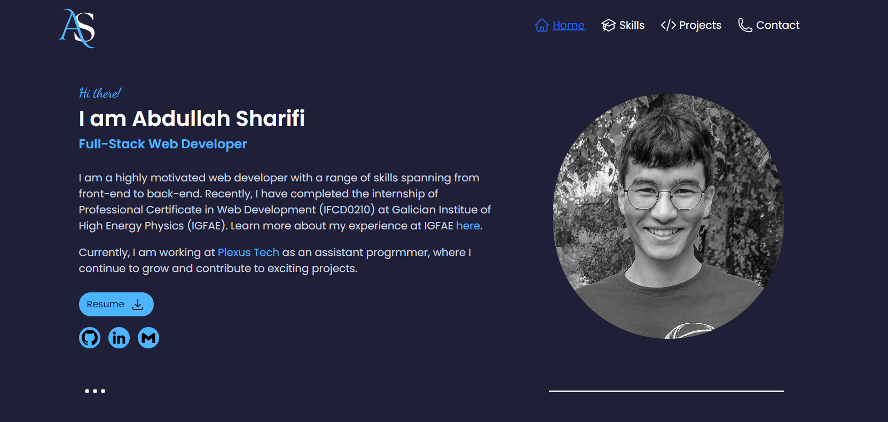

# Web Developer PortFolio with React.js and Tailwind CSS

<div align="center">
    
</div>

## About the project
It's a personal portfolio website. It's completely responsive so you can explore it on any device you like. Check out the live demo: [React portfolio](https://react-tailwindcss-portfolio-abdullah.netlify.app/)

## Installation
- Clone the repository
  ```
  git clone https://github.com/ab-sharifi21/my-portfolio-2024
  ```
- Install the dependencies
    ```
    npm install
    ```
- Start the application
    ```
    npm run dev
    ```

<div align="center"><h2>Technologies</h2></div>


